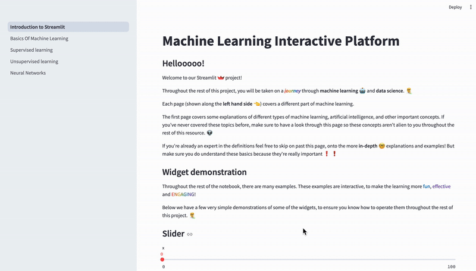
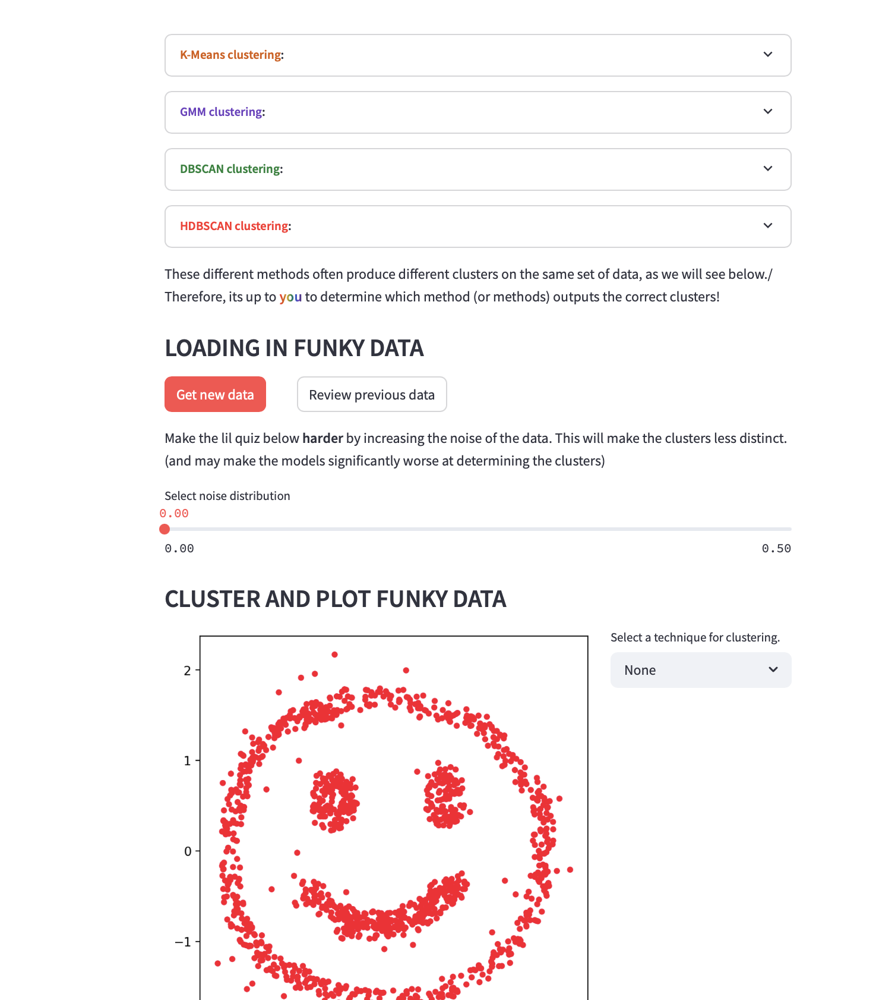
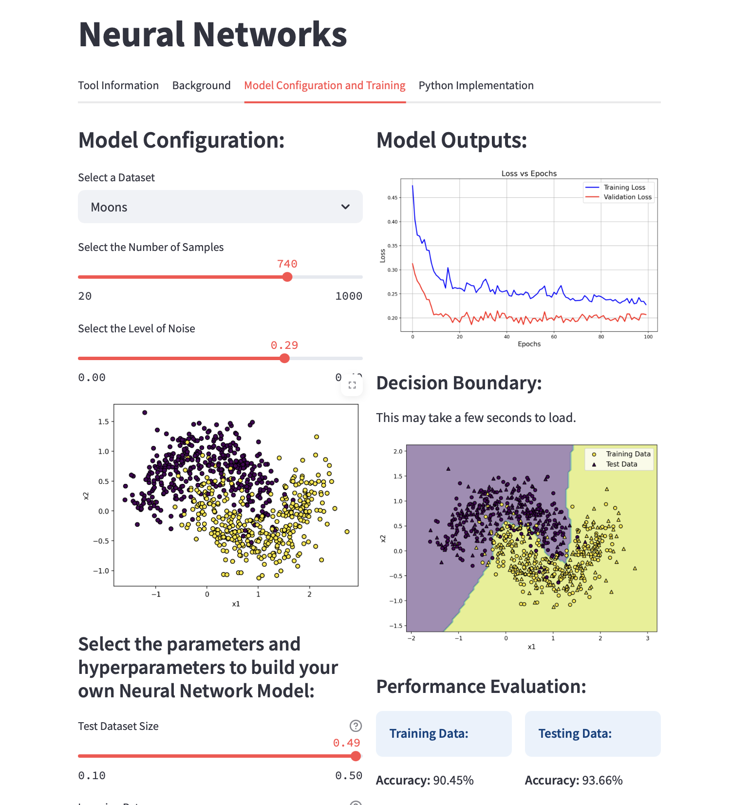

# Interactive Machine Learning Education Platform

## App Description
Welcome to the Interactive Machine Learning Platform. This Streamlit web application is designed for users of all skill levels to explore machine learning through an intuitive, hands-on interface. Navigate through the various sections spanning supervised learning, unsupervised learning and neural networks to understand concepts, algorithms and model behaviour. This tool provides a visual and engaging learning experience offering hidden ML insights without the need for complex coding. For those curious about the technical programming side, code examples are available to help you take that next step in your Data Science education.

We hope you enjoy!

To access the app remotely, click this link: [](https://machine-learning-platform.streamlit.app)


## Key Features

- **User Interactivity**

    - Quizzes (with real-time feedback)
    - Animations
    - Sliders, checkboxes, etc

- **Real-world application**

    - Apply ML techniques to real-world datasets

- **Personalised Model Configuration and Training**

    - Customise, build and train your own ML models without any coding

- **Visualise performance**

    - Displays intuitive model outputs to learn about how different models work

- **Theory and Practice**

    - Gain a theoretical foundation of ML concepts before applying that to practical exercises

**Navigating the app:**
<p align="center">
   
</p>

**Example Interfaces:**




## Local Installation
To run the app locally, follow the instructions below by entering the following in the command line.

1. Clone repository with

``` python
git clone git@github.com:M4ffff/msc_group_project.git
``` 

2. Create environment with:

``` python
conda env create -f conda_environment.yml
```

3. Activate environment with:

``` python
conda activate ml_platform_env
```

4. Run the Streamlit app with:

``` python
streamlit run Introduction_To_Streamlit.py
```

## Navigating the Repository
Files and directory structure:

- `pages/`: Code for each streamlit page
- `Modules/`: Modules containing functions used in each page
- `images/`: Images used in each page with the app
- `datasets/`: Real-world datasets used in the app
- `Introduction_To_Streamlit.py`: Main script to run the app
- `conda_environment.yml`: The conda environment to required to run the app locally
- `requirements.txt`: Dependencies used by Streamlit community cloud to run remotely 
- `app_installation_instructions`: This document contains the link to access the GitHub Pages (README) as an HTML, describing the app and outlining how to run the app locally and remotely


#### Creators  
Matthew Parker, Elliot Ayliffe, Jasmine Dehaney, Ben Mitchell, ZeShu Li 

